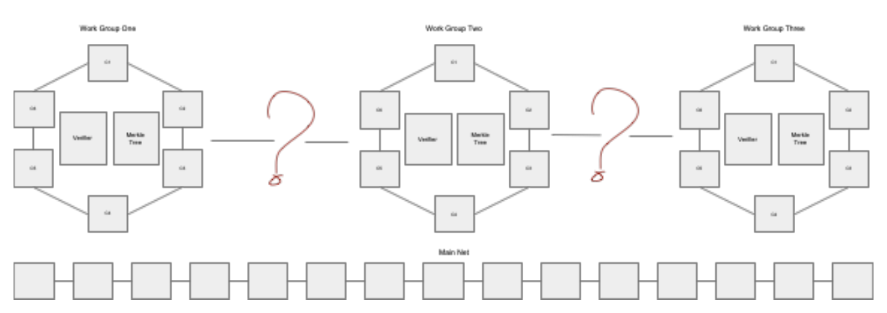
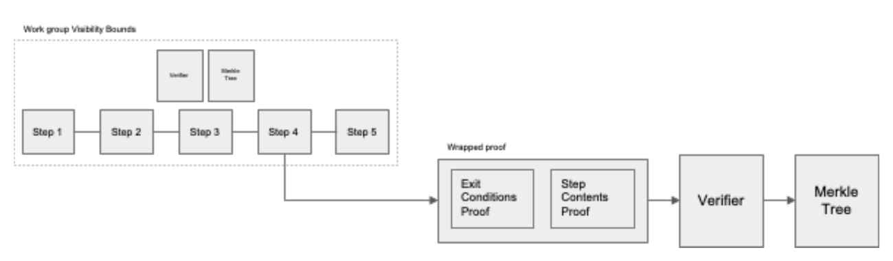
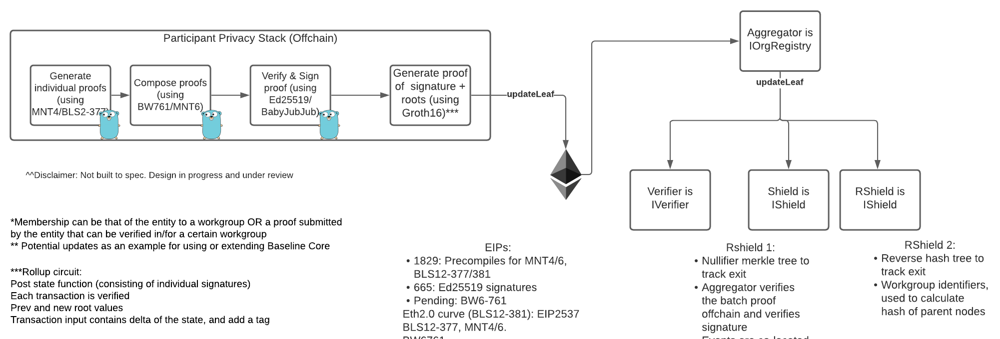

# Layer 2 Scaling

This document outlays an approach to bridging considerations for committing baseline proofs managed across workgoups to the mainnet.

## Motivation

1. Baseline proof verification on the mainnet is a gas intensive process owing to the complexity in computing the verification against the pairing library.
2. Furthermore, there is an added cost of gas to verify the set membership of the document hash in the Shield contract on the mainnet.
3. Enterprises typically have over millions of internal processes, that would be baselined, and it is not feasible to verify every baseline proof on the mainnet.
4. Transactions on the mainnet have intrinsic economic value to indicate the processes' value, transactability/transferability and prevent double spending.
5. While individual baseline proofs need not necessarily have 1:1 correspondence on the mainnet, they can still be represented as a composite transaction on the mainnet.

## Path to Scaling

To scale baseline protocol across multiple participants on the mainnet, there are several criteria to be considered:

* Usability: Ease of use/access to baseline proofs for a given organization and a given process/workflow step.
* Throughput: Ability to process or record a high volume of steps.
* Finality: Finality of the transaction on the mainnet.
* Security: Usage of privacy and hiding of critical data.
* Decentralization: Degree to which the steps need to be validated by a wide variety of participants.
* Updates: Ability to update existing steps in view of changes to an organization's internal processes.

Rank ordering, with "Crucial" indicating absolutely necessary criterion and "Important" indicating essential but not a driving consideration for baselining enterprise systems, below is a scalability matrix of the above criteria:

| Criterion        | Crucial | Important |
| ---------------- | ------- | --------- |
| Usability        |         | Y         |
| Throughput       | Y       |           |
| Finality         | Y       |           |
| Security         | Y       |           |
| Decentralization |         | Y         |
| Updates          | Y       |           |

### Why Bridging?

1. Problem of workgroup interaction scales with a complexity of O(n^2).
2. Workgroup identification and tracking membership is local to each "workgroup" instance.
3. Scaling concerns grow with addition of L2's and proving membership in a particular network. Any L2 protocol basis for running baseline workgroups away from the mainnet have membership concerns.

### Bridging Considerations

1. Any local step of a workgroup can be "materialized" into a token transaction on the mainnet.
2. Determine exit or trigger conditions for exiting a process
3. Upload a "composite" proof to be used by all workgroups to a Merkle Tree Set on the mainnet.
4. Anchor signatures and timestamp deltas for offchain consensus, as inputs to a wrapped rollup (R1CS) circuit.
5. Verify wrapped proof contents and transfer token from one workgroup to another (tied to verifying entry criteria for the target workgroup)

## Bridging Design & Implementation Considerations

### Transition of Membership

* Involves setting up a registration and de-registration mechanism (under constraints of privacy), using “commitments” and “nullifiers”.
* Proving membership in a workgroup by computing new roots and leaves of the Merkle tree, aka “committing” a state(IBaselineRPC.track()).
* Update/Delete of state corresponds to re-computing the roots and leaves, aka “re-committing” and “nullifying” a state(IBaselineRPC.getTracked(), verify())

### Registration and De-registration

* Nullifiers are typically used in the context of “spending” commitments. To nullify is to reveal or “exit” out of a state of commitment (IBaselineRPC.trackNullifier()\*\*) Example: Terms have been met, payment can be issued
* Nullifiers managed as a tracker of shield contract, which in of itself is a separate Merkle tree represents verified de-registration (IBaselineRPC.getTrackedNullifier()\*\*, verify())

## Key Takeaways

1. Layer 2 protocols can be used to scale baseline proofs and leverage recursive proof generations to compose/batch baseline proofs.
2. The composition depicted in the above design assumes a simpler protoocol proof, that is common to any baseline participant to verify BLS signatures of workgroup proofs.
3. Each of the workgroup proofs are created with R1CS circuits, custom and specific to the particular workgroup.
4. The workgroup proof itself is a composition of proofs and the above scheme depicts a simple zk-rollup proof, leveraging gnark as the privacy provider.
5. Using standardized interfaces for Shield and RShield to represent accumulators of commitments and nullifiers, cross chain state can be synchronized to the mainnet.
6. Synchronization to the mainnet, is pre-supposed on the exit condition of signed proofs and can be represented as a trigger for minting token to the mainnet participants.
7. Verifier interface on the mainnet can be defined based on the type of composition and pairing elliptic curve configured for zk-rollup.

## Future Directions

1. Overall baseline protocol proof can be extended to be a multi-sign verification R!CS circuit.
2. Composition scheme can be extended or generalized to work with zk-zkrollups and plonk rollup schemes within the context of enabling privacy using zk-snarks.
3. Extensions to use other zkp techniques such as zk-starks, bulletproofs, etc.
4. Using bilinear accumulators in place of Merkle trees for set membership proofs.

## Contributors

1. Kartheek Solipuram (@skarred14)
2. Kyle Thomas (@kthomas)
3. Lucas Rodriguez (@LucasRodriguez)
