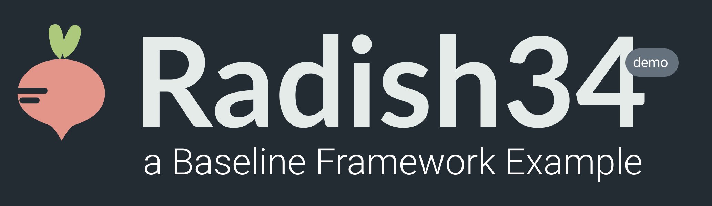

# BRI-1

## Overview

This reference implementation of the core interfaces specified in the v0.1 release of the Baseline Protocol is called BRI-1 and has been contributed to the open source community under a public domain CCO-Universal license by individuals and companies including Provide, EY, Nethermind, ConsenSys, and others. It heavily utilizes the core [Provide](https://provide.services) application stack and is compatible with [Shuttle](https://shuttle.provide.services/waitlist), an on-ramp for _baselining_. [NATS](https://nats.io/) and the [Nethermind](https://nethermind.io/) Ethereum client \(the first client to implement the Baseline Protocol RPC\) are opinionatedly used by default.

The reference implementation is instrumented to run on the Ethereum Ropsten testnet and can be configured to run on many other public or permissioned EVM-based blockchains.

The BRI-1 "base" example codebase can be found [here](https://github.com/ethereum-oasis/baseline/tree/master/examples/bri-1/base-example).

## Provide Architecture

The Provide stack is a containerized microservices architecture written in Golang. The core microservices depend on NATS, NATS streaming, PostgreSQL and Redis. Note that the NATS server component is a [fork](https://github.com/kthomas/nats-server) that supports decentralized, ephemeral bearer authorization using signed JWTs.

### **Core Microservices**

**Ident** provides identity and authorization services for applications \(i.e., workgroups in the context of the Baseline Protocol\), organizations and users. Read more about how authorization works [here](./#authorization).

\*\*\*\*[**Vault**](https://docs.provide.services/vault) ****provides key management for traditional symmetric and asymmetric encrypt/decrypt and sign/verify operations in addition to support for elliptic curves required for advanced messaging and privacy applications.

**NChain** provides [various APIs](https://docs.provide.services/api/container-runtime/orchestration) for building decentralized applications and deploying and managing peer-to-peer infrastructure. The service also provides daemons for \(i\) monitoring reachability of network infrastructure and \(ii\) creating durable, real-time event and analytics streams by subscribing to various networks \(i.e., EVM-based block headers and log events\).

### Dependencies

Each microservice has an isolated PostgreSQL database; each service connects to a configured PostgreSQL endpoint with unique credentials. When running the stack locally \(i.e., via `docker-compose`\), each isolated database runs within a single PostgreSQL container.

NATS and NATS streaming are used as a fault-tolerant messaging backplane to dispatch and scale idempotent tasks asynchronously. Each NATS subject is configured with a `ttl`  for the specific message type which will be published to subscribers of the subject; if no positive acknowledgement has been received for a redelivered message when its `ttl` expires, the message will be negatively acknowledged and dead-lettered.

Redis is used to cache frequently-updated and frequently-accessed key/value pairs \(i.e., real-time network metrics\).

### Authorization

Each microservice requires the presence of a `bearer` API token to authorize most API calls. A `bearer` API token is an encoded JWT which contains a subject claim \(`sub`\) which references the authorized entity \(i.e., a `User`, `Application`  or `Organization`\). The encoded JWT token will, in most cases, include an expiration \(`exp`\) after which the token is no longer valid. Tokens issued without an expiration date \(i.e., certain machine-to-machine API tokens\) can be explicitly revoked. The standard and application-specific JWT claims are signed using the `RS256` algorithm. The authorized entity may use the signed bearer `Token` to access one or more resources for which the `Token` was authorized. Unless otherwise noted, all API endpoints require the presence of a bearer `Authorization` header.

## BRI-1 Reference Architecture

This implementation of the Baseline Protocol leverages the Provide stack for security \(i.e., authn and authz\), managing key material, signing transactions, subsidizing transaction fees __\(i.e., if a gas/subsidy faucet is configured at runtime\), etc. The various APIs in the core Provide microservices fully implement the interfaces defined in the Baseline Protocol specification \(i.e., `IRegistry` and `IVault` interfaces, for example\).

As illustrated above, NATS is used to facilitate the handling of inbound and outbound protocol messages; in the context of the Baseline Protocol, NATS acts as a control plane to route inbound protocol messages to an appropriate asynchronous handler. Such handlers could, for example, ensure that `BLINE` protocol messages represent verifiable, valid state transitions \(i.e., as governed by the business process and privacy protocol\) prior to updating _baselined_ records within a system of record such as SAP or Microsoft Dynamics.

## Messaging

This reference implementation provides a complete, robust implementation of the Baseline Protocol specification. 

**It is important to note that a subset of the specification can be implemented using the core concepts demonstrated in this reference implementation without depending on the entire Provide stack.**

For example, implementing only NATS as a control plane for dispatching inbound protocol messages is possible using only the `@baseline-protocol/messaging` package. In such a case, the entire protocol as demonstrated within this reference implementation would be far from complete, but protocol messages could be sent and delivered.

## 

