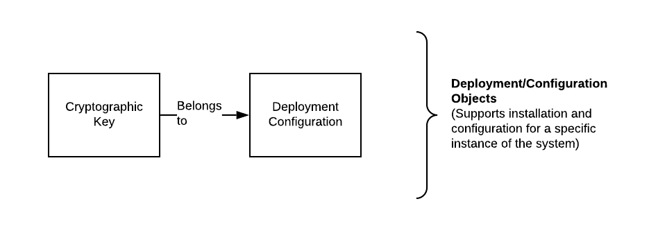

# Radish34 Workflow

| Domain model of the Radish Baseline implementation |
| :--- |

## Business and Supporting Objects

### Supply Chain Objects

These context specific top level business objects such as RFP, MSA Contract, P.O. and Invoice are loosely coupled and only contain external reference to other objects in the previous process flow. This is because it is possible to create any of these on their own \(technically speaking\) depending on the Organizations role and/or phase of interaction with other organizations in the Radish network. However, the application process management logic will re-enforce the proper creation order. It is expected that these objects cross system boundaries and also have on-chain representation. These objects are prominent in the User Interface and the end user can interact with them.

### Generic Business Objects

These object are supporting generic business contexts and the usage of the Radish system in an organization. They are required to run the Radish system but any on-chain identity is managed externally to the object \(internally to the local system\). These objects do NOT cross system boundaries and \(other than account/identity used for messaging or onchain transactions\) do not have on-chain representation. These objects are likely reflected in the UI and the end user can interact with them, though potentially under different labels \(eg User object is managed under "Account"\).

### Technology Specific Objects

These objects are specific to the technology implementation. They encapsulate the delivery of objects, messages, data identity, etc... and help ensure reliability of the system as a whole and durability of the data. These objects are not indented to be used/interacted with by end-users \(but could be for diagnostic purposes\).

### Deployment/Configuration Objects

These support the direct operation of the Radish system as it is installed for a specific environment/deployment in an organizations data center/cloud. Cryptographic keys are stored separately from configuration to support separate access controls and key rotation. These objects need not be managed in an RDMS or storage system, but in the case of the cryptographic keys should be stored in a HSM based vault of some kind.

## RFP Creation Flow

1. Buyer initiates the creation of a new RFP. This will most likely be done via the UI, which then makes the `POST /graphql { createRFP }` mutation request to the `radish-api` service.
2. If the RFP passes the schema validation, `radish-api` stores the new RFP in `mongo`.
3. For each `recipient` listed in the RFP, `radish-api` makes a `POST /messages { type: "rfp_create" }` request to `messenger` to send the RFP via Whisper.
4. `messenger` stores all messages in `mongo`, regardless of the message content.
5. `messenger` sends the message to the supplier's Whisper identity via the Whisper-enabled geth client.
6. The supplier's `whisper client` receives the new message.
7. The supplier's `whisper client` sends a `delivery_receipt` message back to the sender \(buyer in this case\) to let them know that the message reached its destination.
   1. The buyer's `whisper client` receives the `delivery_receipt` and forwards to its `messenger` service.
   2. `messenger` updates the `deliveryDate` field in the original message in `mongo` for verification of successful delivery.
8. Supplier's `whisper client` forwards the `rfp_create` message to `messenger`
9. `messenger` stores the raw message in `mongo`
10. `messenger` inspects the message contents to see if it is a properly formatted JSON object. If so, it forwards the object to `radish-api` via a `POST /documents` request
11. `radish-api` further inspects the message contents for the `type` field. In this example, it detects `type: "rfp_create"`
12. `radish-api` stores the object in the RFP collection in `mongo` if it passes schema validation

