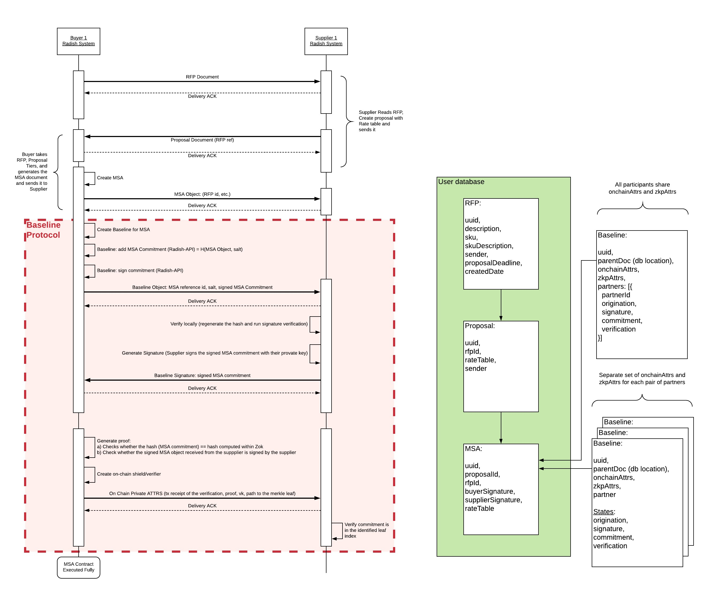
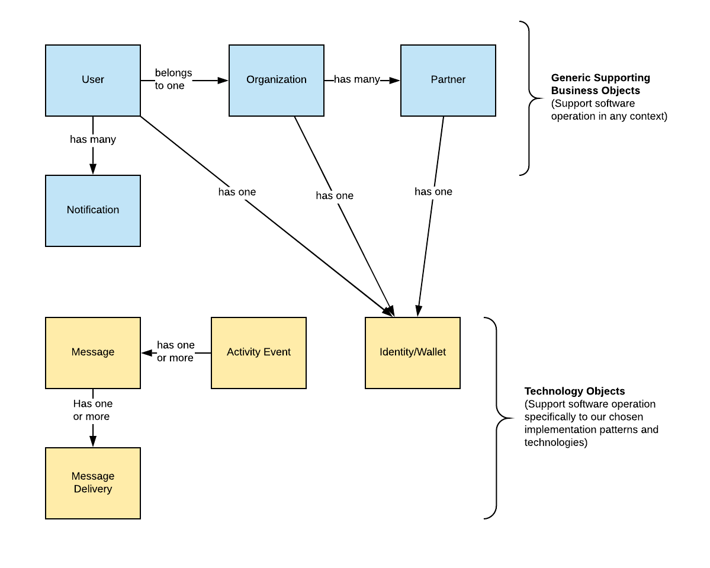

# Radish34 Workflow

### Overview

This document provides a description of the procurement use case as an example/show case of utilizing the public ethereum mainnet for conducting ongoing procurement operations within the constraints of privacy and established baseline requirements to develop a scalable, repeatable, and extensible pattern for enterprises.

Based on discussions around scoping and observing general patterns in the procurement industry, a 2 party system of a buyer who intends to procure goods and a supplier \(manufacturer\), who can provide the finished goods in exchange for a payment. The key interactions between these 2 parties across the process flow is laid out below.

1. RFP \(Request for Proposal\):
   * Buyer places request for proposal inviting suppliers to participate in the procurement process and lays out the procurement needs \(quantity, price, etc.\).
   * Supplier views the RFP.
2. Proposal:
   * Supplier upon receipt of an RFP, responds back to provide a proposal effectively providing the terms by which the supplier can satisfy the procurement needs of the buyer, privy only to the buyer. As an example, we assume that these terms are a volume discount tiering structure to determine the price of an order.
   * Buyer views the details of the proposal.
3. Contract \(Master Service Agreement\):
   * Buyer uses the terms of the proposal to award a contract or an MSA to the supplier based on the proposal from supplier, and privy only to the supplier.
   * Supplier views the agreement, signs the agreement, and provides the signed agreement back to the buyer.
   * Buyer validates and confirms the agreement.
4. Purchase Order:
   * Buyer issues a purchase order to the supplier, privy only to the supplier. Buyer may choose to place an order for any requested quantity in the bounds of the MSA terms. Additionally, the terms of the MSA are used to calculate the price of a given purchase order.
   * Supplier views the purchase order.

### Scoping & Assumptions

1. All 2 party interactions are meant to be strictly privy between the parties in interaction.
2. Data associated with the business process that is legacy to enterprises is never used directly to interact with the blockchain platform.
3. Complex interactions such as negotiations between the 2 parties for any of the above processes are left out of scope of this use case coverage.
4. For this use case, it is assumed that RFP occurs prior to MSA, even though in reality this order varies based on the parties in interaction and other potential related terms and conditions of the agreement process.
5. RFP in some industries can be publicly distributed amongst multiple suppliers to avoid unfair advantage for one versus the other supplier \(for example, in government use cases\).

### Technical/Design Implications

Corresponding to the above breakdown of the processes, below is a listing of technical - design/implementation implications based on the process overview and the assumptions. Moreover, the design of the system allows for a gradual build up of architectural components as we proceed from RFP to MSA to PO

1. RFP: Private communication of the RFPs is done via a secure off-chain communication channel.
2. Proposal: In reality, there may be terms associated with accepting proposals or determining them valid or not. For this use case, we assume that there is no on-chain validation of an RFP.
3. MSA: Co-signing of the documents is a pre-requisite for storing a hash of an MSA on chain. In addition, this process of signing should also ensure that the identity of supplier is never revealed on chain. This is done so by using ZKP \(zk-SNARK\) tooling, and the proofs generated off-chain that verify that the intended supplier has signed the MSA, are verified on-chain.
4. PO: Leveraging the terms of the MSA, a PO is created such that the inputs used to determine the price of the PO are never revealed, but can be verified on-chain using ZKP technologies like zk-SNARK.

During the initial RFP stage, there is an onset of pure off-chain communication. When in the MSA stage, Mainnet is leveraged for notarization and traceability. Finally, in the PO stage, verifiable off-chain computation provides a trigger to an on-chain process that issues POs as tokens.

The figure below describes a particular aspect of creating an MSA, and represented as a sequence diagram.

| Domain model of the Radish Baseline implementation |
| :--- |

## Business and Supporting Objects

### Supply Chain Objects

These context specific top level business objects such as RFP, MSA Contract, PO, and Invoice are loosely coupled and only contain external reference to other objects in the previous process flow. This is because it is possible to create any of these on their own \(technically speaking\) depending on the Organizations role and/or phase of interaction with other organizations in the Radish network. However, the application process management logic will re-enforce the proper creation order. It is expected that these objects cross system boundaries and also have on-chain representation. These objects are prominent in the User Interface and the end user can interact with them.

### Generic Business Objects

These object are supporting generic business contexts and the usage of the Radish system in an organization. They are required to run the Radish system but any on-chain identity is managed externally to the object \(internally to the local system\). These objects do NOT cross system boundaries and \(other than account/identity used for messaging or on-chain transactions\) do not have on-chain representation. These objects are likely reflected in the UI and the end user can interact with them, though potentially under different labels \(eg User object is managed under "Account"\).

### Technology Specific Objects

These objects are specific to the technology implementation. They encapsulate the delivery of objects, messages, data identity, etc... and help ensure reliability of the system as a whole and durability of the data. These objects are not indented to be used/interacted with by end-users \(but could be for diagnostic purposes\).

### Deployment/Configuration Objects

These support the direct operation of the Radish system as it is installed for a specific environment/deployment in an organizations data center/cloud. Cryptographic keys are stored separately from configuration to support separate access controls and key rotation. These objects need not be managed in an RDMS or storage system. Cryptographic keys, however, should be stored in a HSM based vault of some kind.

