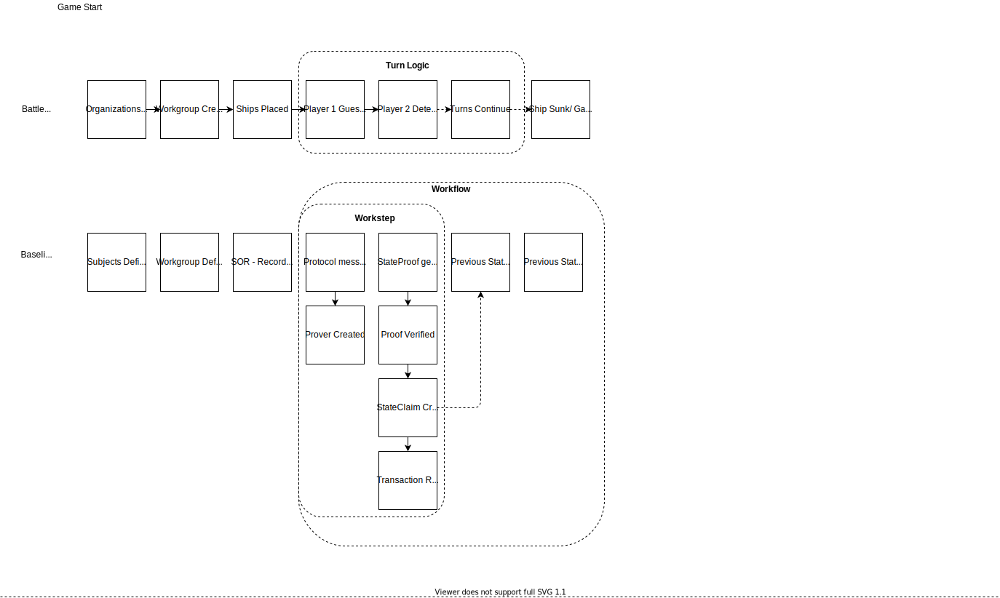

# Battleship: Baseline
Battleship Baseline is a Baseline implementation of the classic search & destroy strategy guessing game. Players are ushered through a (fairly) standard game of Battleship framed entirely within a baseline context. 

## Why Battleship?
Baselining is not easy; Several complex components must work together to produce an externally verifiable outcome without exposing sensitive data. Battleship is a simple, universally known board game that mimics several aspects of a shared business process, therefore is an ideal candidate for demonstrating a baselined process in a tangible, relatable environment.

Below is a list of the components included in Battleship: Baseline and their corresponding Baseline counterparts:
| Battleship | Baseline |
|:--|:--|
|Organization | Organization |
|Workgroup  | Workgroup |
|Gameplay  | Workflow |
|Turn  | Workstep   |
|Board | Document |
|Ship | Record/Private Input |
|Hit | Verified Proof |

## Gameplay
Players generate an organization and join a workgroup. Ships are privately placed on a coordinate grid on which each players ship location is marked. The position of the ship in relation to the coordinate grid is then used to generate current state. Each turn, players attempt to locate their opponents ship through a series of coordinate defined missle launches. Target coordinates and board state are used as inputs in a zero-knowledge proof to determine if the opponents ship is present in the target space. A hit will result in an updated board state and verified proof that is recorded as a leaf in a merkle tree via a transaction to a locally run blockchain. Misses simply progress gameplay. Once a players ship is sunk, the game ends and a final proof is recorded. Because each proof generation triggered by a hit contains board state and previous hits, the final game proof can be used to verify the validity of the entire game.

## Shortcomings

Though simple and useful for representing a baselined process, Battleship is not a perfect example of a Baseline implementation. While illustrative of the utility of zero-knowledge proofs in achieving state synchronization, the method by which it is implemented in Battleship is not representative of a typical business interaction. Typically in a baselined shared business process, counterparties both hold a copy of a particular document within a system of record that should contain like records. The Baseline process uses zero-knowledge proofs to verify that data within those disparate documents is equal before a business process can continue. In the Battleship example, it is not expected that the records (ship positions) within the documents (board) are the same. Instead, Battleship uses zero-knowledge proofs to check the validity of a single data point (target) against an opponents current state (ship position in relation to the board as a whole). The output from this interaction does result in a verifiable proof of data synchronization between a data point and the state, but does not verify synchronization between two disparate states.

