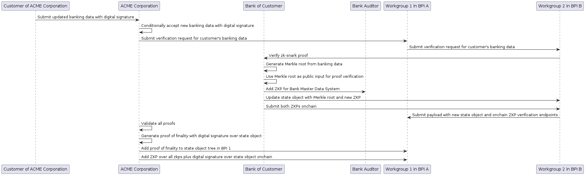

# Baseline Protocol - BPI Interoperability

This is the workspace of the Baseline Interop WG to deliver on the [2023 Baseline Protocol Interoperability roadmap item](https://github.com/eea-oasis/baseline-grants/issues/101).

The WG meets every Friday at 7:30 am PST / 10:30 am EST / 15:30 GMT / 19:00 IST. Please, use this [Zoom link](https://us02web.zoom.us/j/85004523244?pwd=Y0U3N1gxYittSUNYZEZPZGkrQXZDQT09) to join the meetings.

Anyone can participate in the WG and can contribute.

## Requirements and Interop WG Notes Google Drive

The general WG notes can be found [here](https://docs.google.com/document/d/1SDDAjQXY63wZvZtPjrTl543ksUDtYC-j9U2WG-0T6yk/edit?usp=sharing) in this living document. The Interop API discussion and decisions can be found [here](https://docs.google.com/document/d/1vL_fnHnsGuoumK_s2YjAMS2Wjz9E04poqB57cVloytc/edit?usp=sharing).

## Interop Use Case

The WG decided to focus the Interoperability Demo on **the validation of banking data between an enterprise and a bank without exchanging banking data**.

### Motivation 

Exchanging bank data is one of the most sensitive business processes for any enterprise large or small and occurs daily, often multiple times a day. Given its business sensitivity and that banking records also often involve personal identifiable information significantly increases both security and compliance requirements which translates into significant risk and cost.

The Interop Demo is, therefore, aiming to demonstrate how such data validation can be accomplished within a Zero Trust architecture and under Zero-Knowledge, thereby, both reducing the business risk to virtually zero, and reducing costs.

### Use Case Description

**Participants:**
* A Customer of ACME Corporation (requesting a banking data update)
* The ACME Corporation (updating banking data)
* Bank of ACME Customer (verifying the authenticity of customer banking data)
* Bank Auditor (verifying that the Master Data System of the Bank has been properly audited)

**Baseline Protocol Implementation (BPI) Workgroups:**
* Workgroup 1 in BPI A: Customer of ACME Corporation and ACME Corporation, Workgroup 2 of BPI B
* Workgroup 2 in BPI B: Bank of the Customer of ACME Corporation, Bank Auditor, Workgroup 1 in BPI A

To simplify interoperability, the WG decided to have the respective BPIs and their workgroups represented as a BPI Subject with a BPI Subject Account.

**BPI Interop Workflow:**
* **Workstep 1 in Workgroup 1 (BPI A):** Customer submits updated banking data with a digital signature and ACME Corporation conditionally accepts the new banking data with a digital signature. 
    - BPI State object: Customer Banking information with digital signatures of customer and ACME corporation as a Merkle Tree (Document merkelization)
    - Transmission object: zk-snark proof of correctness -- a zk-snark witness but without the public input which is the root of the merkelized document and the DID of ACME corporation -- of the Merkle proofs for each banking data element, and predicate defining the Merkle tree structure in terms of fields to be proven
* **Workstep 2 in Workgroup 2 (BPI B):** Workgroup 1 submits a verification request for its customer's banking data. (Minimally, just DID of Customer and zk-snark witness without the public input), then the Bank verifies the zk-snark proof by generating a Merkle root from its banking data and using that as the public input for proof verification, and after the proof is verified, the Bank Auditor adds a ZKP that Bank Master Data System is correct and updates the state object with the Merkle root and the new ZKP and submits both ZKPs onchain.
* **Workstep 3 in Workgroup 1 (BPI A):** Workgroup 2 submits payload with new state object (everything together) + onchain ZKP verification endpoints to Workgroup 1, ACME corporation validates all proofs and generates a proof of finality through a digital signature over the entire state object which is added to the state object tree in BPI A and a ZKP over all zkps plus the digital signature over the state object is added onchain.

<figure>
  
  <figcaption> Figure 1: Baseline Interop Demo Use Case</figcaption>
</figure>

## Data Schemas

The interoperability data schemas can be found in the [schemas folder](./schemas/).