# Vendor Bank Verification Workflow with BRI-1

## Setup

### Configuration via Provide Shuttle

<b>Create account at https://shuttle.provide.services</b>

Use your email to create an account. You will be prompted to configure an organization and your org-level Vault configuration along with other agreements to accept.

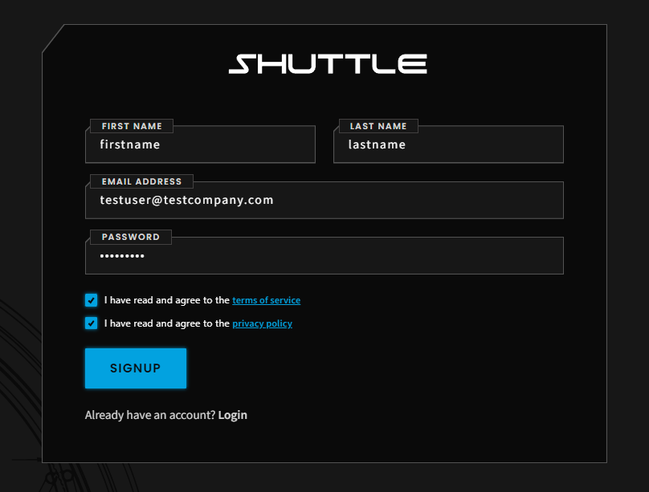

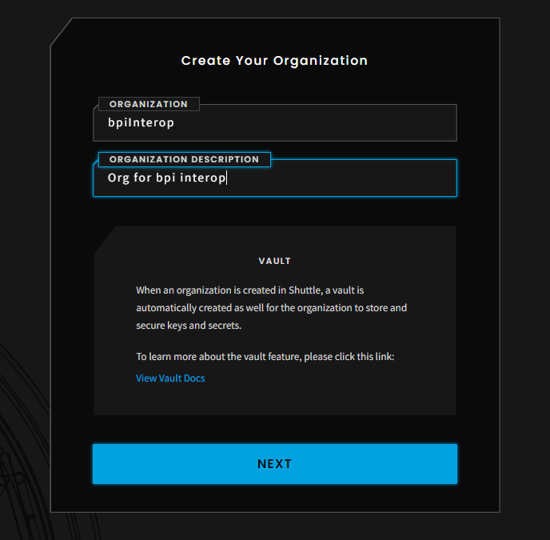

<b>Define workgroup</b>

Upon creating your organization, you will be immediately prompted to create your work group. Accept the Vault privacy policy and continue. 

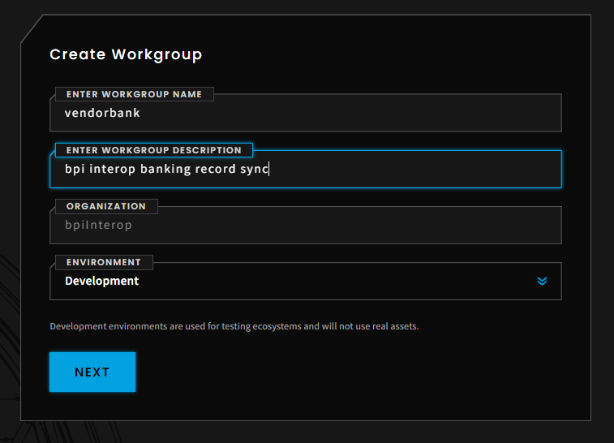

Configure fields of the bank record synchronization message type. 

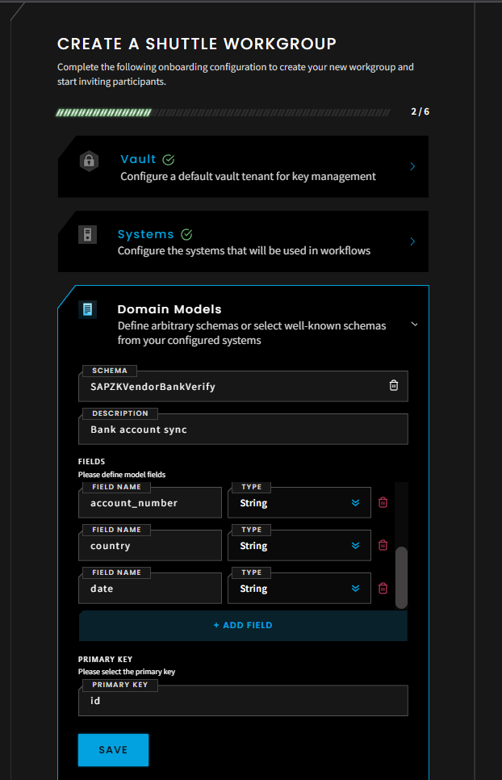

Choose the PRVD network layer 3 testnet. Continue.

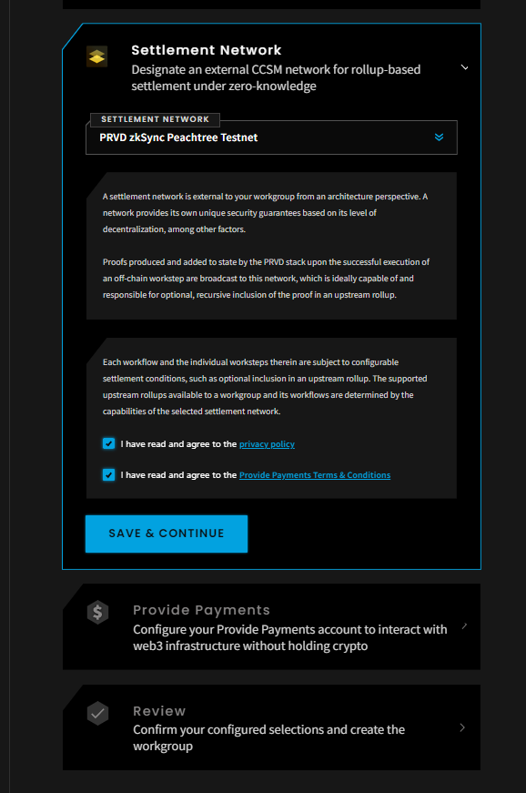

Continue until "Finish onboarding" can be selected.

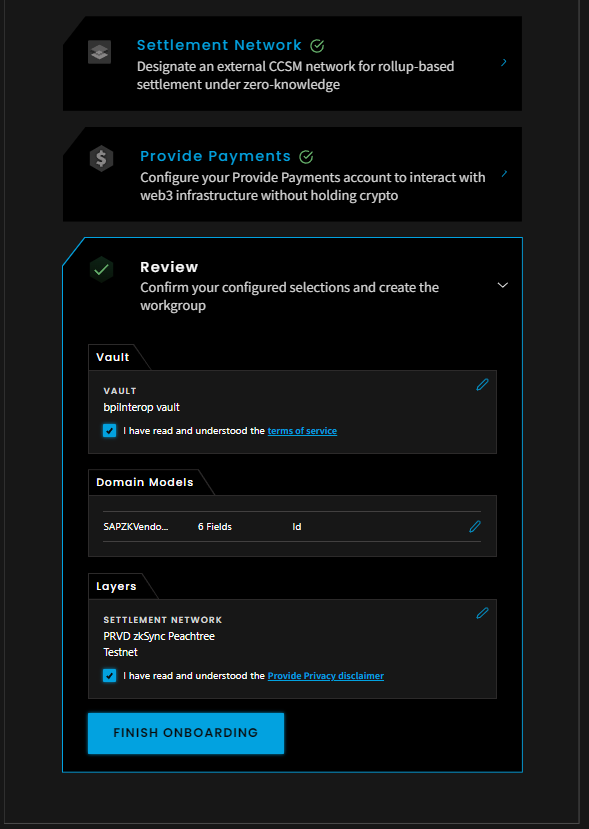

Upon successful workgroup creation - you will be redirected to the Shuttle homepage.

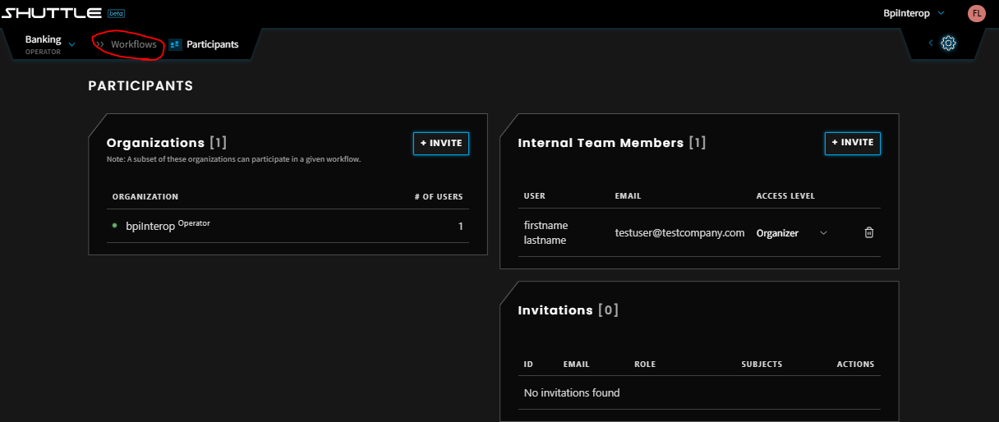

<b>Configure workflow</b>

Select the workflows tab.

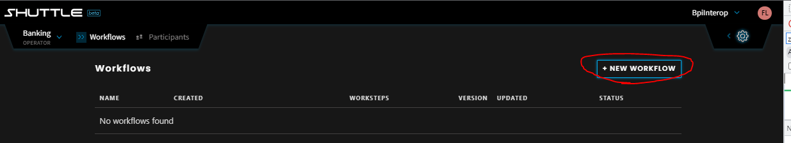

Create the workflow. Save and select + to create workstep.

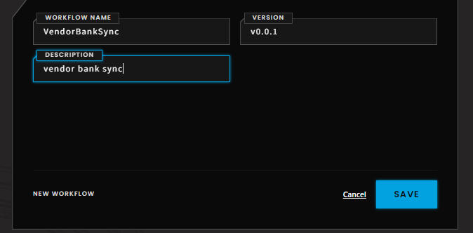

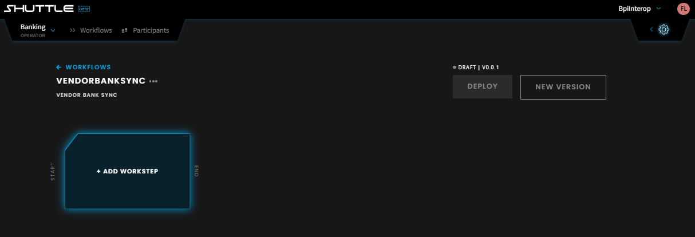

Configure the workstep. Add a name and description. Select the general consistency circuit. Select the previously configured schema. Add participants as needed. Click save.

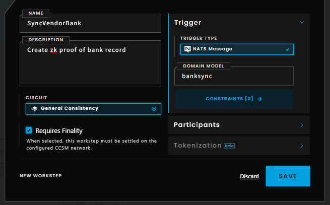

Once all worksteps are created - deploy the workflow.

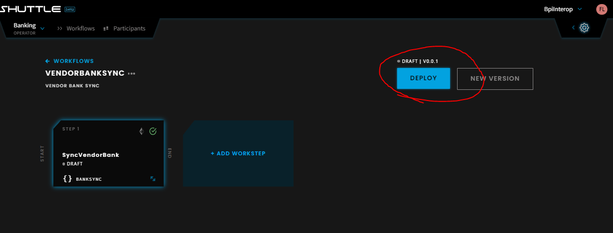

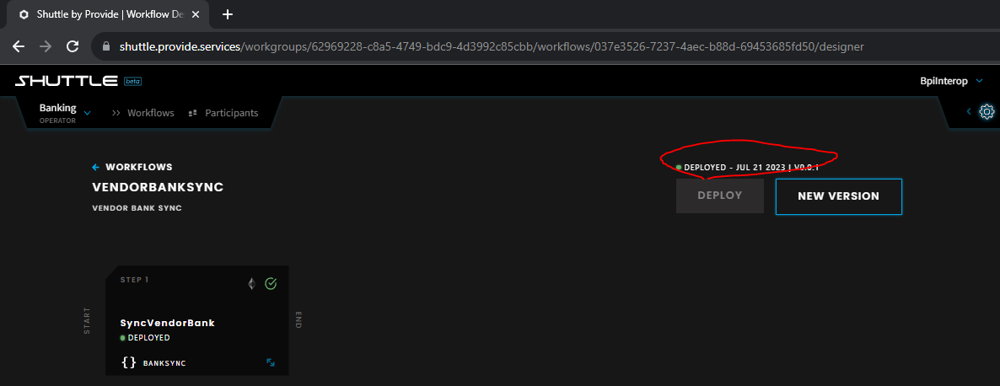

Once successfully deployed - the zk-workflow can be reached/triggered via API

### Postman configuration, credentials generation, initial protocol message test

<b>Maintain Shuttle Credentials</b>

Use the email and password in the ```{{shuttle_email}}``` and ```{{shuttle_password}}``` collection variables

<b>Generating the refresh and access tokens</b>

Execute Postman requests in the following order
1. Authorize Access Token
2. List organizations
3. JWT Authenticate - Generate long dated refresh token
4. JWT Authenticate - Generate short dated access token from refresh token

<b>Maintain the workgroup id, subject account id</b>

For a given workflow, maintaining the correct workgroup id and subject account id in the collection variables is essential for the protocol messages to work correctly.

Review the console outputs when executing "List organizations". You can verify you have the right workgroup and subject account id in the additional endpoints provided.

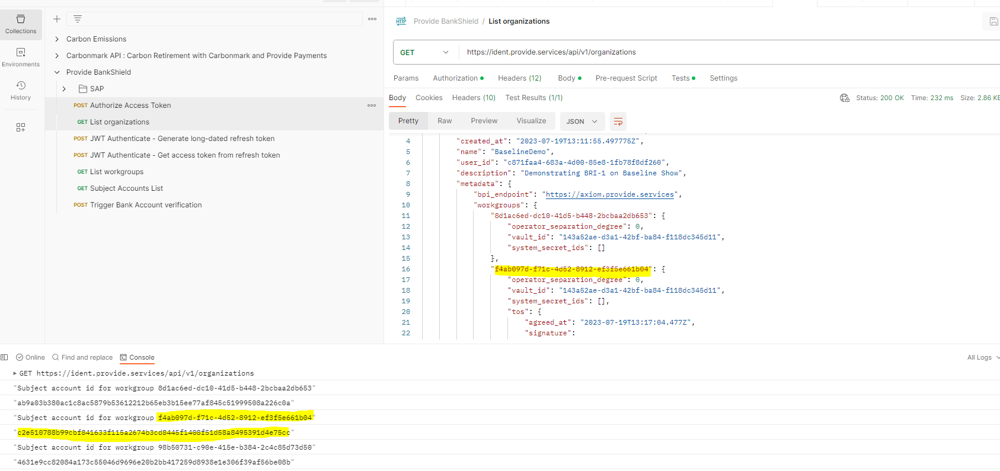

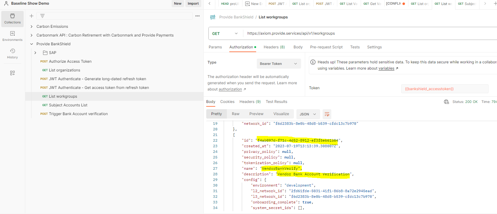

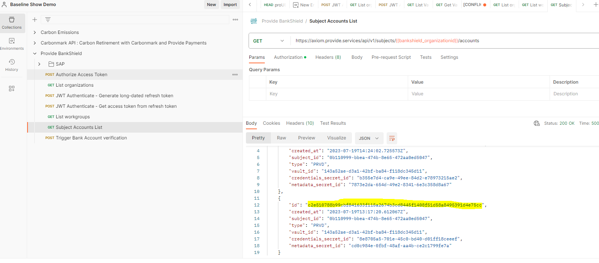

Maintain the desired workgroup and subject account id in the collection variables

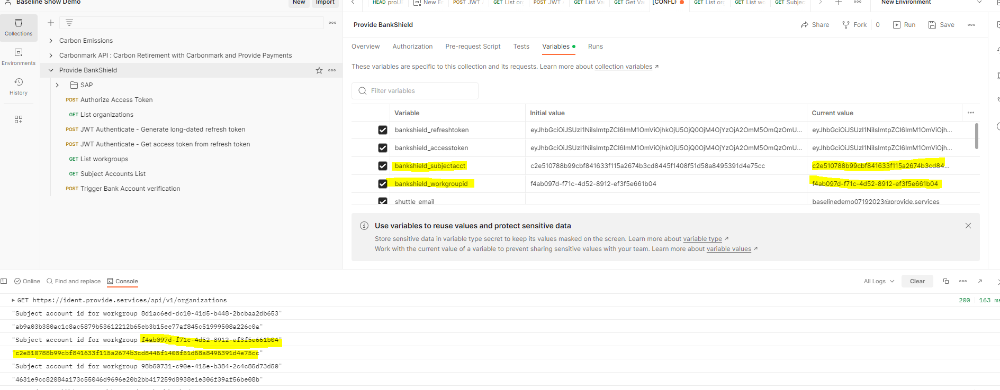

<b>Test the protocol messaging from Postman</b>
While authenticated, Go to the Trigger Bank Account Verification request

Add data to the blank fields and execute

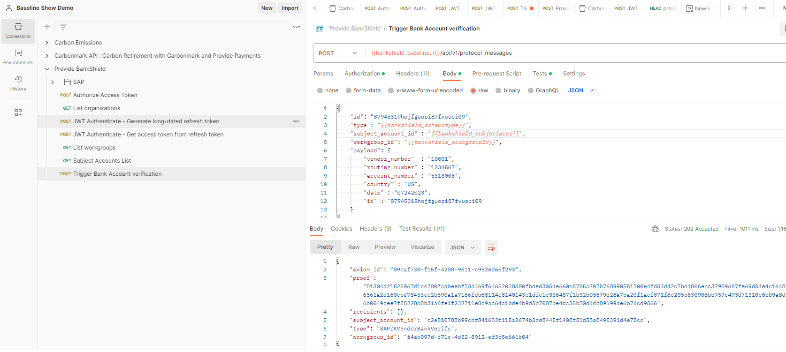

<b>Review ZKP in Shuttle</b>

View the console where you originally deployed the workflow


### Node.js Sample Script

<b>Install packages</b>

Run command ```npm install```

<b>Maintain .env file from Postman collection variables</b>

<b>Create Baseline Protocol Message</b>

Run command ```node create_protocol_msg```

<b>Review ZKP in Shuttle</b>

View the console where you originally deployed the workflow. You'll see an additional protocol message created in the console.


### SAP Sample Program

<b>Pre requisities</b>

Use this SAP sample program does require the install and configuration of [provide-abap](https://github.com/provideplatform/provide-abap) as a pre-requisite. Additional details are documented [here](https://docs.provide.services/provide-abap)

<b>Credentials onboarding to SAP</b>

Use the SAP folder of the Postman collection

Maintain the SAP basic auth credentials in postman

Execute fetch

Execute tenant creation

Review the record in ZPRVDTENANTS table

<b>Program execution</b>

Execute the SAP program via transaction code SE38 or SE80

This will produce a protocol message reviewable in Shuttle's workflow console as previously demonstrated.