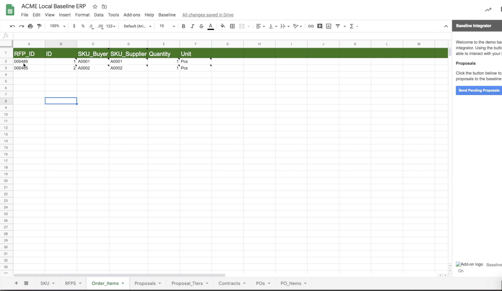

**⚠️ The "Baseline Mycrosoft Dynamics and Google Sheets" initiative is being integrated with [this new reference implementation](https://github.com/ethereum-oasis/baseline/tree/master/examples/shuttle-app) as a result of the `v0.1` release.**

**🚀 The "Baseline Mycrosoft Dynamics and Google Sheets" source code can be found [here](https://github.com/ethereum-oasis/baseline/tree/init-core/examples/google-sheets-connector) on the `init-core` branch, as discussed above.**

# Baselining Business Process Automation across SAP and Microsoft Dynamics

##### George Spasov ([Limechain](https://limechain.tech)), Vlad Ivanov ([Limechain](https://limechain.tech)), Kyle Thomas ([Provide](https://provide.services))

May 21, 2020

# Introduction

The "Baseline Mycrosoft Dynamics and Google Sheets" shows establishing a common frame of reference on the public Ethereum Mainnet between Mycrosoft Dynamics and Google Sheets. The demo extends the [Radish34 POC](https://docs.baseline-protocol.org/bri/radish34/radish34-explained), showing a procurement process in a supply chain POC.

The open-source-available code of the development work continues the positive trend of Baseline demos showcasing the connection between two system with quite different level of sophistication.

# What is Baseline?

The Baseline Protocol is an approach to using the public Mainnet as a common frame of reference between systems, including traditional corporate systems of record, any kind of database or state machine, and even different blockchains or DLTs. It is particularly promising as a way to reduce capital expense and other overheads while increasing operational integrity when automating business processes across multiple companies.

The approach is designed to appeal to security and performance-minded technology officers.

You can find all the details on the Baseline Protocol [here](https://docs.baseline-protocol.org/baseline-protocol/protocol).

# Challenges and Scope of Work

Continuing the work from the SAP and D365 demo, this demo aims to showcase that two seemingly different in level of sophistication systems, can be kept in sync through the concept of baseline. This is required as more than 30% of the vendors of the big enterprises are small niche vendors lacking the resources and need to integrate a sophisticated system.

The Use-case shown in the demo follows this path:

### Intro
- Julia is the supply manager in the "USMF - Contoso Entertainment System USA". She deals with finding and working with suppliers. Contoso uses Microsoft Dynamics 365 to manage all its operations.
- Todd is the owner of the small niche HDMI manufacturing plant called ACME. Todd is quite happy to manage his plant via good old Google Spreadsheet.
- Julia is in need of HDMI cables and has found Todd.
- This demo will show how "Baseline" can help Julia and Todds records stay in sync despite Todd not using a sophisticated system.

### RFQ

- Through the Dynamics Finance and Operations module Julia creates a Request for Quotation.
- She specifies the HDMI cables that she needs and adds delivery details.
- Then she specifies that ACME should receive this request and sends it.
- In a minute Todd sees his spreadsheet populated with the latest request from Julia.

### Proposal

- Todd reviews the request and decides to send a formal proposal to Julia. He enters the proposal data.
- Through Google Sheets add-on he connects to his baseline service and sends the proposal back to Julia.
- In a minute Julia receives the offer from Todd.

### Contract

- As Julia is happy with Todds proposal, she accepts it and proceeds to create an agreement out of Todds proposal.
- In a minute, Todd receives the agreement data in his spreadsheet through his baseline service.

### Purchase order

- With the agreement in place, Julia decides to buy some items from Todd.
- Through the Purchase Orders module in Dynamics 365 she creates a new Purchase order and specifies the items and quantities she needs.
- She confirms the purchase order and sends it to Todd.
- In a minute, Todd receives the purchase order in his spreadsheet through his baseline service.

The proposed architecture and solutions to these challenges are presented in the next sections.

# Architecture Proposal

The diagram above outlines the major architectural components. The following sections will give you an more in-depth overview of these components.

- Julia D365 - The Microsoft Dynamics ERP environment of Julia
- Julia Provide Shuttle - The Baseline service of Julia
- Ethereum mainnet - The ethereum mainnet and the Baseline Smart Contracts needed
- Todds Provide Shuttle - The Baseline service of Todd
- Todds Worker Google Cloud Functions - Cloud functions that synchronise Todds spreadsheet with Todds Shuttle regularly
- Todds Google Spreadsheet with Sheets Baseline Add-on - Google Spreadsheet with installed Sheets Add-on written in apps script

## Baseline Environments
TODO Kyle

## Microsoft Dynamics ERP
The Microsoft Dynamics ERP component is extension code written that connects to the Provide shuttle environments. It is written in X++ - the native language for Dynamics. It translates the native Dynamics objects to the ones required by the Baseline Service. Also regularly polls the Baseline service for news coming from the network.

## Google Sheets
The google sheets side is a regular google spreadsheet with an Baseline Add-on installed. Regular repeating cloud tasks are polling new info from the Baseline service and insert it in the correct tables. In addition through the Add-on Todd is able to connect and send data to his Baseline Service.

