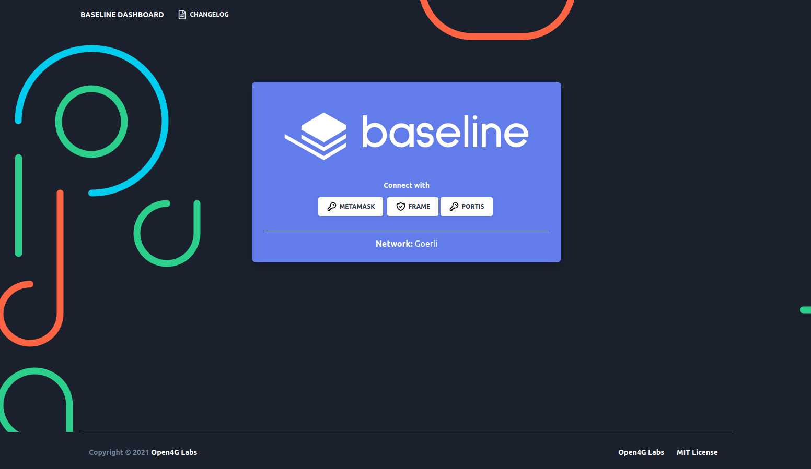
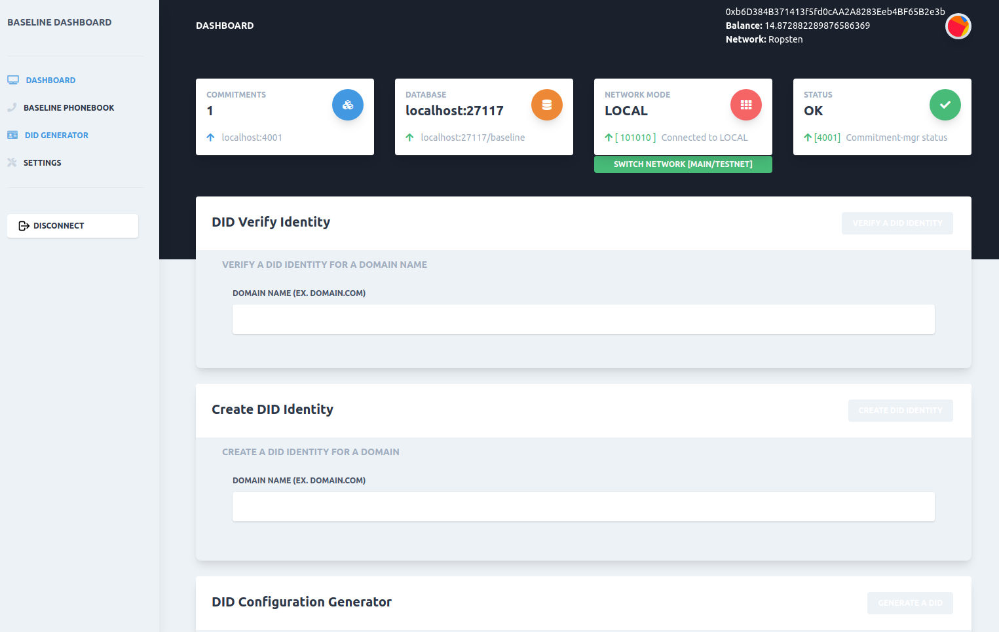

# bri-2

`bri-2` is the second "baseline reference implementation". The purpose of this project is to show a baseline stack using different services compared to `bri-1`, but this stack must still comply with the baseline standards and specificiations, therefore allowing interoperability with other baseline stacks. `bri-2` introduces the `commit-mgr` service to `baseline`. The `commit-mgr` acts as an extension to a web3 provider, which allows a variety of Ethereum clients to become "baseline compatible". 

> Note: `bri-2` is still a work in progress. Components such as a vault/key manager, messenger, and system of record integration need to be added to make it a complete reference implementation.

Here is a comparison of the reference implementations:

| Service Type | bri-1 | bri-2 |
| -------- | ----- | ----------- |
| Eth. client | `Nethermind` | `commit-mgr` + `mongo` + `ITX` |
| Key managment |`Provide Vault` | TBD |
| Messenger | `NATS` | TBD |

## Proposed Architecture

The purple/orange blocks in the following diagram have been built. The green blocks are proposed services to be added and interact with the exisiting services.


# Baseline Chain Dashboard(bri-2)


# Requirements
- docker and docker-compose
- node / npm
- yarn
- [metamask wallet](https://metamask.io/download.html)
- ether account with some funds - [get Goerli faucets here](https://faucet.goerli.mudit.blog/)
- [a infura account id](https://infura.io/)

# Usage and installation

### 1. Clone Repo

```sh
git clone https://github.com/sekmet/Baseline-Chain-Dashboard.git
```

### 2. Install packages and dependencies

```sh
cd Baseline-Chain-Dashboard
```

```sh
npm install
```


### 3. Build

```sh
npm run build:all
```


### 4. Run development enviroment

```sh
npm run up:besu
```

```sh
npm run dev
```


### Or production enviroment

```sh
npm install -g pm2
```

```sh
npm run prod
```


# 5. Setup and Settings

- Open [http://localhost:3000](http://localhost:3000) in your browser
- Login using your metamask wallet account
- Go Settings -> fill "infura id" and wallet private key fields -> Save

>*Switch network feature only fully works under production enviroment*


# Video Demo

[](https://youtu.be/Nm9v373pL0s)


# Screenshots







# Contracts [GOERLI TEST NET]

[Shield.sol - 0x63758bc241d4cd924ebfbed273a2f6a1179f8f86](https://goerli.etherscan.io/address/0x63758bc241d4cd924ebfbed273a2f6a1179f8f86)

[VerifierNoop.sol - 0x76f272ba2b1c3887f117dfeeb600e53b50a2207b](https://goerli.etherscan.io/address/0x76f272ba2b1c3887f117dfeeb600e53b50a2207b)


# Change Log

## Alpha Release [0.1.0] 2021-01-28
[X] started project Baseline Chain Switcher Demo and Components
[X] added UI Dashboard

## [0.1.1] 2021-01-29
[X] added commit-mgr service tests report to dashboard
[X] commit-mgr should be configurable via env vars such that it can use Infura as its web3 provider
[ ] a repeatable test suite should be written to ensure baseline transactions can be submitted through Infura
[X] Shield.sol and Verifier.sol contracts should be deployed on a public testnet/mainnet (verifiable via etherscan or similar)
[ ] root/leaves of on-chain merkle-tree in Shield contract should match root/leaves of off-chain tree stored in mongo
[X] commitments made in private Besu network should be replicated on public testnet/mainnet

### Bonus features:
[X] add Well-Known DID configuration generator
[X] add simple Baseline Phonebook UI
[ ] use a faucet account or another way to fund public testnet/mainnet transactions so that judges can easily run test suite.
[ ] find a way to securely+efficiently move what has already gone to the private Besu chain instance and move that to the public ethereum mainnet before commencing with new transactions.
[ ] the verification circuit enforces some business logic (instead of using a no-op circuit)
[X] add a UI that allows the user to configure the commit-mgr service

## Alpha Release [0.1.3] 2021-02-10
[X] commit-mgr updated
[X] dashboard UI moved to ./bri-2 folder
[X] DID service moved to ./bri-2 folder
