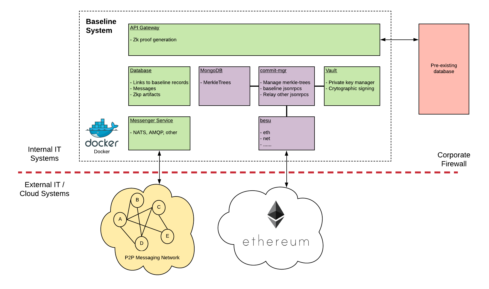

# bri-2

`bri-2` is the second "baseline reference implementation". The purpose of this project is to show a baseline stack using different services compared to `bri-1`, but this stack must still comply with the baseline standards and specificiations, therefore allowing interoperability with other baseline stacks. `bri-2` introduces the `commit-mgr` service to `baseline`. The `commit-mgr` acts as an extension to a web3 provider, which allows a variety of Ethereum clients to become "baseline compatible". 

> Note: `bri-2` is still a work in progress. Components such as a vault/key manager, messenger, and system of record integration need to be added to make it a complete reference implementation.

Here is a comparison of the reference implementations:

| Service Type | bri-1 | bri-2 |
| -------- | ----- | ----------- |
| Eth. client | `Nethermind` | `commit-mgr` + `mongo` + `ITX` |
| Key managment |`Provide Vault` | TBD |
| Messenger | `NATS` | TBD |

## Proposed Architecture

The purple/orange blocks in the following diagram have been built. The green blocks are proposed services to be added and interact with the exisiting services.

