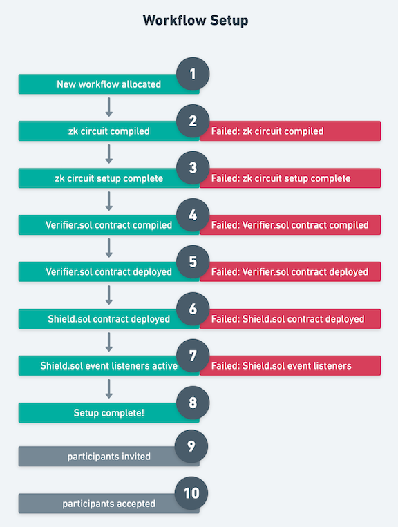

# bri-2

`bri-2` is the second "baseline reference implementation". The purpose of this project is to build a baseline server that is compliant with the core baseline API specification. Most of the contributions to this project have been made by ConsenSys employees, but the source code is open-source and all contributions are welcome.

# Requirements

- docker
- docker-compose
- node v12.16
- npm
- ConsenSys docker registry login credentials (for the `key-manager` service)

> **Note**: The `key-manager` docker image used by `bri-2` is currently stored in a private docker registry. In order to get access, please contact Sam Stokes via the baseline Slack to get login credentials. ConsenSys is in the process of moving this image to a public docker registry where it will be made available for development environments, but will require a contract with ConsenSys for use in production environments.

# Quickstart

```
make build
make start
```

## Workflow creation

After the docker containers have successfully initialized, make the following request to `workflow-mgr` in order to create a new workflow.

```
POST http://localhost:5001/workflows?type=signature
{
   "description": "signature test",
   "clientType": "test client",
   "chainId": "101010",
   "identities": [
       "4bd3822517db41e55a9d234187b22215187d20ba37d83208ddc7788dc473f31e"
   ]
}
```

This request should initiate the following sequence of events. The sequencing of steps is accomplished by using NATS as a job queuing service. If successful, steps 1-8 will be completed and the workflow object will have a ZkCircuitId, Shield contract address, Verifier address, and a status of `success-track-shield`.



## Run `dashboard` front-end

In order to run interact with the `bri-2` stack through a browser, please run the following commands.

> Note: be sure to use `node v12.16`

```
cd dashboard
npm install
npm run build
npm run dev
```

Navigate to `http://localhost:3000` on your web browser to view the `dashboard`.

# Troubleshooting

- If you have an existing bri-2 build, run the following sequence to remove old build artifacts:

```
make clean
make build
make start
```

- You may need to run `make build` twice in order to properly compile smart contracts
  > Note: Environment variables default to use `ganache` as the Ethereum network

# Current Capabilities

- Create new workflows
- Automatically generate, compile, and run setup for zero-knowledge signature-checking circuit
- Automatically compile newly created Verifier Solidity smart contract
- Automatically deploy Shield and signature-checking Verifier smart contracts to `ganache`

# Future Capabilities

- Create new commitments (hashes of JSON objects) for the Workflows
- Push the commitments (hashes) into the on-chain merkle tree inside the Shield contract
- P2P messenger service for communicating commitment details to counterparties
- Integrated L2 to reduce mainnet gas fees
- Automated integration level test suite
- Codefi Orchestrate Key-Manager service integrated for Eth/EDDSA key storage and signing capabilities

# Architecture

Here is a comparison of the reference implementations:

| Service Type   | bri-1           | bri-2                |
| -------------- | --------------- | -------------------- |
| Eth. client    | `Nchain`        | `commit-mgr` + `ITX` |
| Key management | `Provide Vault` | `Codefi Orchestrate` |
| P2P Messenger  | `NATS`          | `NATS`               |


