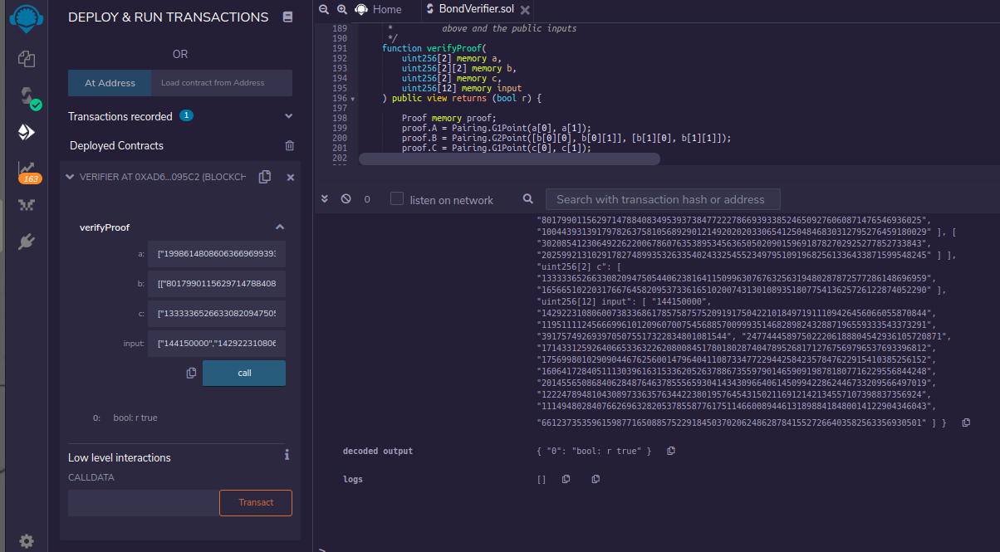

# Financial Circuit

Writing zero-knowledge circuits using `gnark` to expand the existing library – Focus on Financial Circuit Development and Approach

## Technologies Used 

* [Gnark 0.4](https://docs.gnark.consensys.net/en/latest/)
* [Baseline](https://github.com/eea-oasis/baseline)

# Diagram

## Run Tests
 `go test`

## Overview

Develop/research financial circuits which will include working and tested code, diagrams, document method/approach to extend functionality.

The proposal is to build circuits for baselining over-the-counter (OTC) Corporate Bonds (Vanilla & Exotic Bonds) trades . Presently corporate bonds are traded between broker-dealers who are acting on their clients behalf. In many instances the Bloomberg platform is used as a price discovery tool, trade execution platform, reference data etc.

**High level current process**

Bonds are recognized by broker dealers in Bloomberg often on behalf of clients and trades executed. Banks middle office complete/verifie/reconcile trade details.
At the time of the trade the following attributes are private: Party, Counter party, Trade details, yield, instrument traded etc. Trade details need to be made available in the TRACE (FINRA’s Trade Reporting and Compliance Engine) in 15 minutes after the trade. Please keep in mind 15 minutes in trade processing is a long time.

**Proposed Circuits in gnark - Financial Circuits**

Develop circuits for baselining over-the-counter (OTC) Corporate Bonds:

* Vanilla Bonds
* Exotic Bonds - Callable, Puttable, Perpetual
* FRN Bonds
* Credit Derivatives - stretch

The circuits will be built in such a manner that they will keep the details of the trade private for 15 minutes. After that per regulatory requirement the information of the trade will become transparent to the regulators, trade participants and the general public.

> **_NOTE:_** **Callable Bonds** - is a bond with an embedded call option. It provides the issuer of the bond with the right, but not the obligation, to redeem the bond before its maturity date. **Floating rate notes** - are bonds that have a variable coupon. **Step-Up Coupon Bonds** - The coupon of a step-up coupon bond, which may be fixed or floating, increases by specified margins at specified dates.

**Motivation**

Strong belief that [Baseline protocol](https://github.com/eea-oasis/baseline/blob/master/README.md) on public blockchain will set a new direction for participants and financial regulators that want/need to coordinate multi party business processes with privacy and without putting sensitive enterprise information on the blockchain.

**Specific expected project benefits**

* Research and build financial circuits using `gnark`. Steps and challenges to build this application will be documented and made available.
* Building a Baselined – private, cost effective and regulatory conforming trade circuits/confirmation process, for OTC instruments in scope.
  Presently users need to pay for TRACE data and for services to complete EOD trade reconciliation with Front Office Blotters.
* Gives a  chance/opportunity to smaller participants who can’t afford Bloomberg service and require a safe, inexpensive, audited and baselined/confirmation process.

**Implementation**

The implementation can process Requests for Bids for Vanilla Bonds and Exotic Bonds ( Callable, FRN and Step Up).

**Flow steps**

 1. The initiating party request quote for a specific bond/Isin. That can be done via an existing platform or NATS
 2. Responders/Counterparties respond with signed quotes.
 3. Initiating party selects the quote for the Bond/Isin and the corresponding counterparty.

**What off chain rules gnark Circuit enforces:**

- A quote can not be zero or negative.
- Selects the smallest quote submitted for the specific Bond by the participating counterparty. (that  can be verified via the deployed smart contract/circuit by the counterparty).
- For other participating counterparties for which a quote was not accepted the verification/circuit will fail   .
- If all quotes received are the same, the first one received in sequence will be accepted.

## ZKP

[1] Which parties should be aware of the zk circuit source code?
Coded by Initiator and all counter parties in scope agrees with the algorithm

[2] What are you trying to prove (via zk proof)?
- smallest quote was accepted (in this scenario)
- all quotes come from only counter parties in scope 

[3] Who are you trying to prove something to?
Only the accepted counter party knows its quote was accepted.

[4] What are you trying to conceal (private inputs in zk proof)?
It conceals the quotes

[5] Who are you trying to conceal private inputs from?
Counter parties don't know each other quotes.

## Test
Verifier smart contract was deployed on Rinkeby for tests purpose. Here is the Etherscan link:
https://rinkeby.etherscan.io/address/0xad6ba91bd376050e807b67cd2ff83a638b3095c2#code

You can use remix to test it since Etherscan form to Write parameters didin't work with 2 dymension array.

For test # 7, Test 7 - Cpt1 Quote: 93 - Cpt2 Quote: 98 - Cpt3 Quote: 94 - Initiator Party selects the smallest integer quote
you need the values below to test the Verifier:

**a:**
["19986148086063669699393915079219583317329018538179236390727851645992144476866",
"13682626214479896181683270627421909231653527134440534352941182839979684448830"]

**b:**
[["8017990115629714788408349539373847722278669393385246509276060871476546936025",
"10044393139179782637581056892901214920202033065412504846830312795276459180029"],
["3020854123064922622006786076353895345636505020901596918782702925277852733843",
"20259921310291782748993532633540243325455234979510919682561336433871599548245"
]]

**c:**
["13333365266330820947505440623816411509963076763256319480287872577286148696959",
"16566510220317667645820953733616510200743130108935180775413625726122874052290"]

**Input:**
["144150000",
"14292231080600738336861785758757520919175042210184971911109426456066055870844",
"11951111245666996101209607007545688570099935146828982432887196559333543373291",
"3917574926939705075517322834801081544",
"247744458975022206188804542936105720871",
"17143312592640665336322620800845178018028740478952681712767569796537693396812",
"17569980102909044676256001479640411087334772294425842357847622915410385256152",
"16064172840511130396163153362052637886735597901465909198781807716229556844248",
"20145565086840628487646378555659304143430966406145099422862446733209566497019",
"1222478948104308973363576344223801957645431502116912142134557107398837356924",
"11149480284076626963282053785587761751146600894461318988418480014122904346043",
"6612373535961598771650885752291845037020624862878415527266403582563356930501"]

Here is the printscreen of how Remix would show:

## License

This project is licensed under the MIT License - see the [LICENSE](LICENSE) file for details
