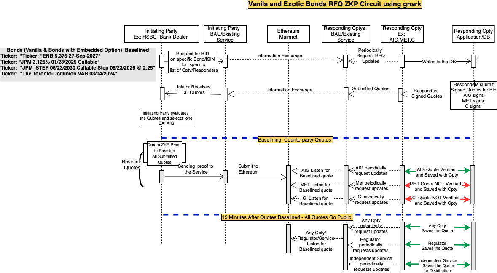

# Financial Circuit

Writing zero-knowledge circuits using gnark to expand the existing library – Focus on Financial Circuit Development and Approach

## Technologies Used 

* [Gnark 0.4](https://docs.gnark.consensys.net/en/latest/)
* [Baseline](https://github.com/eea-oasis/baseline)

# Diagram

## Run Tests
 `go test`

## Overview

Develop/research financial circuits which will include working and tested code, diagrams, document method/approach to extend functionality.

The proposal is to build circuits for baselining over-the-counter (OTC) Corporate Bonds (Vanilla & Exotic Bonds) trades . Presently corporate bonds are traded between broker-dealers who are acting on their clients behalf. In many instances the Bloomberg platform is used as a price discovery tool, trade execution platform, reference data etc.

**High level current process**

Bonds are recognized by broker dealers in Bloomberg often on behalf of clients and trades executed. Banks middle office complete/verifie/reconcile trade details.
At the time of the trade the following attributes are private: Party, Counter party, Trade details, yield, instrument traded etc. Trade details need to be made available in the TRACE (FINRA’s Trade Reporting and Compliance Engine) in 15 minutes after the trade. Please keep in mind 15 minutes in trade processing is a long time.

**Proposed Circuits in gnark - Financial Circuits**

Develop circuits for baselining over-the-counter (OTC) Corporate Bonds:

* Vanilla Bonds
* Exotic Bonds - Callable, Puttable, Perpetual
* FRN Bonds
* Credit Derivatives - stretch

The circuits will be built in such a manner that they will keep the details of the trade private for 15 minutes. After that per regulatory requirement the information of the trade will become transparent to the regulators, trade participants and the general public.

**Motivation**

Strong belief that [Baseline protocol](https://github.com/eea-oasis/baseline/blob/master/README.md) on public blockchain will set a new direction for participants and financial regulators that want/need to coordinate multi party business processes with privacy and without putting sensitive enterprise information on the blockchain.

**Specific expected project benefits:**

* Research and build financial circuits using gnark. Steps and challenges to build this application will be documented and made available.
* Building a Baselined – private, cost effective and regulatory conforming trade circuits/confirmation process, for OTC instruments in scope.
  Presently users need to pay for TRACE data and for services to complete EOD trade    reconciliation with Front Office Blotters.
* Gives a  chance/opportunity to smaller participants who can’t afford Bloomberg service and require a safe, inexpensive, audited and baselined/confirmation process.

## Risks
gnark has not been fully audit yet and is provided “as-is” we might encounter some challenges/blockers that will require assistance from the gnark/ConsenSys team.

We might find limitations in gnark circuit development, that might require more time to build than initially planned.

## ZKP

[1] Which parties should be aware of the zk circuit source code?
Coded by Initiator and all counter parties in scope agrees with the algorithm

[2] What are you trying to prove (via zk proof)?
- smallest quote was accepted (in this scenario)
- all quotes come from only counter parties in scope 

[3] Who are you trying to prove something to?
Only the accepted counter party knows its quote was accepted.

[4] What are you trying to conceal (private inputs in zk proof)?
It conceals the quotes

[5] Who are you trying to conceal private inputs from?
Counter parties don't know each other quotes.
