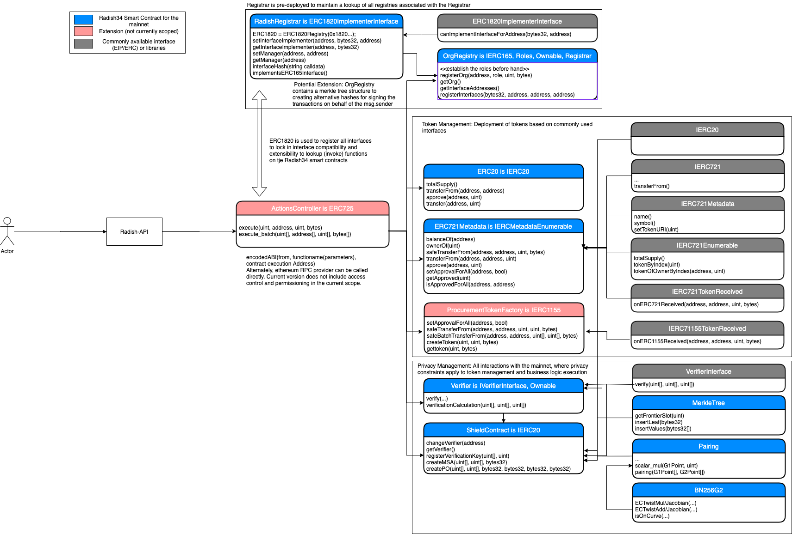

# Solidity Smart Contracts

## What is here?

This folder contains the solidity smart contracts component for managing the registration of companies/organizations that want to participant in the Baseline protocol as applied to a specific procurement use case (Radish34).

Assumptions:

- OrgRegistry contract is deployed and contains public identity information for the different parties. OrgRegistry is deployed as part of the initialization process. However, any number of registries can be created/registered depending on the need. This applies to all smart contracts covered under Radish34, that are key for managing the business process - registries, tokens, and privacy related contracts.
- Onboarding of different parties to the network is assumed to be done (as part of decentralized identity management). To this extent, the additional data used for registering organization can be marked as dataUri or an ENS domain registry
- Buyer’s address can be set in the clear based on understanding of the business implications
- Off-chain data is delivered from one party to another via radish's messenger service, and is always encrypted in-transit. Only a hash of the off-chain data is ever stored on-chain (for integrity)
- During the process of RFP placement, we assume no constraints/adjustments/negotiations on price or quantity
  set during the proposal of the RFQ nor the responses to the RFQ
- Complex and custom business needs related variations such as negotiations, token hierarchies, and additional verifications for business logic integrity are left out of scope to leave room for collaborated extensions
- Integration with oracles has been left out of scope as part of the initial implementation

## How does this fit in to Radish?

During setup of a Baseline/Radish instance there is a registration process. This registration process creates a new record for the company performing the setup in a global registry. The record contains information like the company name, location, etc... It also contains important cryptographic identifiers that are used throughout the Baseline process. 

From the perspective of the procurement process, the key interactions are as follows:

### 1. Deployment Process:

Refer to the [Deployment](../deploy/README.md) job component for details on the deployment operation.

- Registrar

  - Description: Leverages EIP 1820 (GlobalRegistrar) for registering multiple interfaces
    (registries/factories for ERC721 tokens, organizations, Shield Contracts, and Verifier). To
    avoid coupling with all the registries, the ERC1820 can be instantiated within the
    Registrar
    `(ERC1820Registry constant ERC1820REGISTRY = ERC1820Registry(0x1820a4B7618BdE71Dce8cdc73aAB6C95905faD24);`
    Registrar acts as a client to the global registry (ERC1820Registry) and enables a lookup/control facility 
  - Key Capabilities:
    - setInterfaceImplementer: Sets the interface for:
      - a given address (an Ethereum account or smart contract; in this case it is the sender’s
        account address for organization registry; and organization registry address for all other
        registries)
      - name of the interface
      - address of the deployed contract
    - getInterfaceImplementer: Gets the interface for:
      - a given address (an Ethereum account or smart contract; in this case it is the sender’s
        account address for organization registry; and organization registry address for all other
        registries)
      - name of the interface
    - setManager: Sets the manager by taking the existing and new addresses. Note that if ERC725 is
      leveraged, accordingly the proxy contract is to be made the manager to be able to execute
      methods on registries
    - interfaceHash: Computes the interface hash for the interface name

- Example deployment: Below is an example of the deployment of `OrgRegistry.sol`. 
    - `Registrar(_erc1820)` indicates the inheritance pattern using Registrar. On the main net, 
       there wouldn't be a need to leverage a custom deployment of `erc1820` as there is an existing ERC1820 address on the mainnet, 
       which can be substituted below with `0x1820a4B7618BdE71Dce8cdc73aAB6C95905faD24`
    - Note that this is a constructor of the OrgRegistry contract which self registers an interface name `IOrgRegistry`.
      In a similar manner, other key interfaces for tokens, shield contracts and verifier contracts in Radish34 smart contract system

```Javascript
    constructor(address _erc1820) public Ownable() ERC165Compatible() Registrar(_erc1820) {
        setInterfaces();
        setInterfaceImplementation("IOrgRegistry", address(this));
    }
```

### 2. Process Management

- Verifier

  - Description: Verifier contract is based on `VerifierInterface`, that contains methods for on-chain verification of an off-chain zkSnark proof. The verification mechanism uses `Pairing` library which contains elliptic curve operations on a BN256G2 curve. In particular this verification is specific to the proving scheme chosen for this effort - GM17
  - Key Capabilities:
    - verify: An overloaded function that verifies the proof against the verification keys provided as inputs. Upon successful verification, this method returns a true or false. An important aspect of these inputs, is that they are generated by using `Zokrates` to create off chain proofs under ZKP (more specifically, a zkSnark proof using GM17 proving scheme). In the case of an MSA, the proof is checking for logical constraints around the MSA: Has the MSA been signed by the intended parties? Are the business validation checks passing? Detailed coverage of these proofs is covered in [ZKPDocumentation](../zkp/README.md)
    - To ensure that the input arguments to this function are not over the upper limit of the zkSnark prime upperbound value; and the proof arguments are not over the zkSnark scalar input upperbound values, the `require` assertions in the code disallow unbound inputs

- Shield

  - Description: Shield contract is an escrow wallet that holds tokens and funds, while maintaning anonymity of linkage between the parties involved in a business transaction or process. This leverages a Merkle Tree contract, which is used to instantiate a Merkle Tree that contains hashes (in the leaves), that represent key events or markers in a business process.
  - Key Capabilities:
    - createMSA: Stores hash of an MSA in a merkle tree. The hash, also called as a commitment is made of the metadata of the MSA, signatures of the buyer and supplier (the parties involved in the process), and a random salt. In addition, the function also takes arguments for verification of an on-chain proof to thus `verify` the inputs (using the imported `Verifier`), before updating the Merkle tree leaf in the Shield contract
    - createPO: Similar to above, this also pertains to storing a commitment of the purchase order. However, in addition to verifying the off chain proofs for creating a purchase order (i.e., verifying the calculation of a price of a purchase order), this method also ensures that the correct on-chain hash of the MSA is used. In the process of issuing purchase orders, every subsequent purchase order must use the correct starting volume consumed to date to be able to issue a rightly priced PO. Thus for every PO issued, the state of the metadata that is being tracked in the MSA commitment changes, and therefore, the existing MSA commitment is "nullified", in its place a new MSA commitment is pushed to a new Merkle tree leaf and a commitment to indicate the hash of the PO is also stored in a new leaf. The ZKP related aspects for this process are covered in [ZKPDocumentation](../zkp/README.md)

## How can I run it?

All smart contracts contained in this directory, are compiled as part of the build process: `npm run build`. This process inherently leverages the `sol-compile` service, which compiles the solidity code to EVM bytecode and ABI definitions and stores them in `artifacts/`.

To deploy the contracts, there is a deployment script that deploys these contracts using the artifacts of compilation process above, to a given network. This can be run by executing the following instruction in the parent folder: `npm run deploy`.

When the Radish34 system is initialized, all smart contracts are deployed and registered with the ERC1820Registry. During the bootstrap process, a script deploys the contracts and prepares them for interaction during on-going procurement processes. In Radish34, the system of smart contracts is scoped to a particular network or workgroup of participants. However, other interfaces can be defined and leveraged for a set of participants and, by extension, any form of global interfaces can be registered/deployed for different business needs and type/set of participants.

### To run the tests...

All smart contract based tests are contained in `__tests__` directory under this directory. There is a service called `jest`, which looks for any `.test.js` files, and runs the test cases. Execute the following series of commands to run the tests:
```shell
npm run build
docker-compose up ganache
npm run test
```
** These tests take about 25 seconds to run **

<details> 
  <summary>Example logs</summary>
  <p> 

  ```
  PASS  __tests__/Shield.test.js (12.348s)
    ✓ Successfully deploys Shield contract (760ms)
    ✓ Successful registerVerificationKey transaction for createMSA (314ms)
    ✓ Successful createMSA transaction (1249ms)
    ✓ Rejects createPO tx if verificationKey has not been registered (61ms)
    ✓ Successful registerVerificationKey transaction for createPO (203ms)
    ✓ Rejects createPO tx if inputs_hash is wrong (32ms)
    ✓ Successful createPO transaction (1154ms)
    ✓ Rejects redundant createPO tx (1074ms)

  PASS  __tests__/Verifier.test.js (5.267s)
    ✓ Should be able to deploy Verifier contract (422ms)
    ✓ Should be able to successfully execute verify transaction (2365ms)
    ✓ Should be able to throw when input to verify function overflows snark scalar bound (195ms)
    ✓ Should be able to throw when proof to verify function overflows prime bound (81ms)

  PASS  __tests__/OrgRegistry.test.js
    ✓ Deploy Org Registration (349ms)
    ✓ Should be able to set interfaces for compatibility checks (84ms)
    ✓ Should be able to correctly set the interface id (36ms)
    ✓ Should be able to get 0 count at the beginning (17ms)
    ✓ Should be able to register an org (176ms)
    ✓ Should be able to register an orgs interfaces (87ms)
    ✓ Should be able to get all interface details for an org (27ms)
    ✓ Should be able to retrieve the incremented org count (15ms)
    ✓ Should be able to retrieve registered org details (35ms)
    ✓ Should be able to get registrar info (42ms)
    ✓ Should be able to assign new manager (127ms)
    ✓ Should be able to get registrar info as new manager (103ms)

  PASS  __tests__/ERC1820Regisry.test.js
    ERC1820 Registry tests
      ✓ Should be able to set the interface hash (33ms)
      ✓ Should be able to set an implementer address (70ms)
      ✓ Should be able to get the implementer address (17ms)
      ✓ Should be able to remove interface (57ms)
      ✓ Should be able to get the updated implementer address (19ms)
      ✓ Should be able to change manager (55ms)
      ✓ Should be able to get the changed manager (18ms)
  
  Test Suites: 4 passed, 4 total
  Tests:       31 passed, 31 total
  Snapshots:   0 total
  Time:        22.876s
  ``` 
  </p>
</details> 

## What is the architecture? 


The system of smart contracts in Radish34 can be explained in the form of the following higher level patterns or groupings
of the various smart contracts

#### Organization Management

- OrgRegistry

  - Description: Leverages ERC165 and Roles contracts to register organizations
  - Capabilities:
    - Register organizations and maintain an on-chain phonebook for organizations, the interfaces used
      and basic identity management pertaining to the needs of the procurement usecase
    - Metadata of the org entity include name, role, ethereum account addresss, messaging key (whisper comm)
      and an additional key to manage private signature verification
    - Other methods such as addRole, removeRole, getRoleType are used as well, and can be handled
      as part of the bootstrap process

#### Token Management

- ERC721(20)

  - Description: Leverages the ERC721, ERC721Metadata, ERC721Enumerable to maintain a registry index
    of ERC721’s along with a factory capability to create new ERC721 tokens.
  - Capabilities:
    - Create ERC20 and ERC721 tokens and manage token transfers
    - Manage private creation, transfer or spend of tokens on-chain while maintaining privacy of data/values
      of tokens under zero knowledge

#### Privacy Management

- Verifier

  - Description: Used for on-chain verification of zkSnark proofs created off-chain using Zokrates
  - Capabilities:
    - On-chain verification of proofs using public inputs to provide validation of the proof.
      Events emitted during interaction with Verifier allows for listeners to capture/tag key events and triggers
    - All verifications on-chain can be registered using registerVerfication method
    - Uses pairing-friendly elliptic curve BN256G2, which is pre-compiled on the EVM to enable on-chain verification

- Shield

  - Description: Uses a merkle tree structure for storing cryptographic commitments
  - Capabilities:
    - Ability to mint token or document commitments (PO or MSA, as examples) to compute the hashing
      on-chain (using a SHA256 variation)
    - By interaction with the Verifier and requiring the on-chain verification of a proof, any business
      process or action can be verified on-chain before storing a hashed representation of such an action
      in the Merkle tree

## How can this be improved?

- ActionsController

  - Description: Leverages ERC725 to execute transactions on behalf of another Ethereum address
    (account or contract)
  - Potential Capabilities:
    - Execute: Executes an action on other contracts or a transfer of the blockchains native
      cryptocurrency. MUST only be called by the current owner of the contract (inspired by ERC1077
      and Gnosis)
    - Execute_batch: Executes a batch set of transactions to be deployed on a target contract
      address

- ProcurementTokenFactory
  - Description: Leverage other standards like the ERC1155 Multi-token standard to extend abilities
    to deploy multiple fungible and non-fungible tokens
  - Potential Capabilities:
     - Ability to extend the funactionality of batch execution in ActionsController by 
       maintaining a link to the ActionsController
     - Further capabilities include abilities to relaease tokens for integration with existing main net
       wallets and DeFi provisions, within the constraints of privacy
     - Extensions to shield and verifier contracts as a factory deployment model

- OrgRegistry
  - Description: Leverage other identity token standards such as element and collaborative development toward
    decentralized identity management
  - Potential Capabilities:
     - Enhance org registry to include ENS or any other domain registries for the corporate identity of organizations
     - Enhancements toward treatment of org registry as a corporate wallet that can hold funds as well as permissions to access control actions across other contracts
     - Integrations with relay contracts for executing meta transactions, while also leveraging ActionsConteoller

- Shield Contract
  - Description: Leverage other optimizations of the managing cryptographic commitments for better performance and
    lower gas consumption
  - Potential Capabilities:
     - Optimizations to merkle tree structures and extensions to identity management to hide the identity of the
       parties in interaction
     - Other form of data structures such as accumulators, sparse merkle trees, etc.
     - Associated extensions to verifier contracts for on-chain verification under other EC's and pairing libraries
     - Extensions to shield and verifier contracts as a factory pattern to generate contracts from contracts,
       which could include other hashing mechanisms such as Pedersen, Mimc, etc.

## References:
- [EIP1820Registry](https://eips.ethereum.org/EIPS/eip-1820)
- [ERC1155 Multi Token Standard](https://eips.ethereum.org/EIPS/eip-1155)
- [Zokrates Verifier Contract](https://github.com/Zokrates/ZoKrates/blob/585fc01020a6ca51949403ae095f03477f76ab9f/zokrates_book/src/reference/cli.md)
