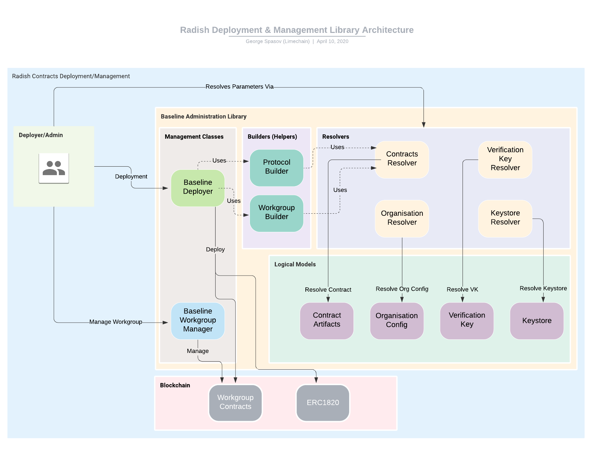

# Deployment Job component

## What is here?

This is a dev utilty/convenience for deploying smart contracts to the blockchain network. Refer to the `contracts/` documentation for detailed explanation of the deployment model.

## How does this fit in to Radish?

During the initialization of the Radish34 system, smart contracts are deployed to the blockchain network. 

## How can I run it?

Run `npm run deploy` to deploy the contracts, which utilize the artifacts updated in the `artifacts/` upon running the build step: `npm run build:contracts`.

## What is the contracts architecture? 

- Deployment is handled as a one time job wherein ERC1820 standard is used for deploying all the Radish34 contracts
- Deployment operation is handled as being run by a `deployer` as a user. This is done so that the role of an administrative or operator entity could deploy contracts on behalf of a workgroup

## What is the contract deployment & management library architecture?

The Radish contracts deployment and management library will be used as basis for the Baseline deployment and management library and the baseline-administrator tools. Here is an overview of the library and several Radish specifics.

### Setting the scene

The idea behind the library is to act as a foundation for generation of tools used for baseline deployment and management. The current version is fitted for the needs of Radish34 but has been built with extensibility in mind (without overengineering it based on the project youth). The main user of this library is the workgroup administrator allowing her/him to deploy the needed contracts and manage the workgroup through them.

### Logical Input Objects

There are 4 (+1 included in the last section for Radish specific config) main logical input objects. These are needed in order for a workgroup to be created. These are:

- Contract Artifacts - artifacts needed for the deployment of the contracts. At minimum these should have the contracts bytecode, name and abi. In Radish34 these are taken from the artifacts produced from the compilation.

- Keystore or Key Provider - object allowing a wallet to be derived out of it. This wallet will be used for further blockchain network interaction. In Radish34 these are taken from the keystore directory

- Organisation Config - object carrying organization specific information. At a minimum these should have the organization name, role and zero-knowledge private key. In Radish34 these are taken from predefined configuration files.

- Verification Key - object carring a verification key and type for a specific ZK circuit. In Radish these should be requested from the zkp service.

### Resolvers

All main logical input objects can have multiple ways to be inputted. In order to allow for new ways of resolving these objects, the notion of Resolvers is introduced. As long as Resolvers follow a similar interface, the "action" classes will be able to use them to resolve the necessary logical input objects. In the Radish34 demo, each logical object has it's specific resolver based on the source of the object.

For Contract Artifacts it is based on a .json configuration file. For Keystore it is based on directory and the name of the organisation. For Organisation it is based on directory and the name of the organisation leading to a config file. For the verification key it is based on a http request.

Using this approach, new resolvers can be defined and included in the library, which will allow for better extensibility. This would be beneficial, especially for resolving sensitive data (like private keys) remotely;

### Baseline Deployer

The baseline deployer is an action class allowing its user to deploy the current baseline contracts (currently these are only the Radish34 contracts).

The deployer expects an ethers.Signer object and ethers.Provider object as creation parameters. These will be used in all subsequent deployments.

At the moment, two types of contracts can be logically outlined - protocol contracts and workgroup contracts.

The protocol contracts are contracts that are expected to be already in place in the public networks. For local development these need to be deployed. Example of these is the ERC1820Registry contract that is available on Mainnet, but not on your local ganache.

The workgroup contracts are contracts specific for the workgroup being created. These will be deployed on any network you are using - mainnet or local. Example of these contracts are the OrgRegistry, Shield and Verifier.

#### Builders

The depolyment procedure is aided by two builder classes - for the two contract types. These builder classes allow the administrator to specify which parts of the deployment process to be executed. This will come especially handy when extending this library to different Baseline tools.

Once the builders are used to create deployment tasks, these tasks are submitted to the deployer object and the deployer returns the deployed contract instances.

### Baseline Workgroup Manager

The baseline workgroup manager class is an action class allowing its user to manage a workgroup. At present times, a workgroup is defined by three contracts - OrgRegistry, Shield and Verifier. Once these are supplied (connected to the intended transaction sender), the workgroup manager can start managing and configuring the workgroup.

Current abilities of the workgroup manager are:

- Registering organisations

- Registering organisation interfaces

- Registering verification keys

### Radish specific config

One additional logical object specific to Radish is defined. This object defines the different organizations that the Demo will be bootstrapped with.

Outside of the demo context of Radish34, the processes of deployment and administration will probably be detached. This means that this configuration object will probably be passed separately for each organization. The current version is only tailored for Radish34.

## How can this be improved?

- On-demand or adhoc deployment to allow for custom deployment operations at run time
- Upgrade contracts using proxy delegation methods to account for upgradability of the different contracts that are registered with ERC1820: `OrgRegistry`, `Shield` and `Verifier` contracts
- Enhancements to the deployment job for mainnet deployment via a funded wallet
